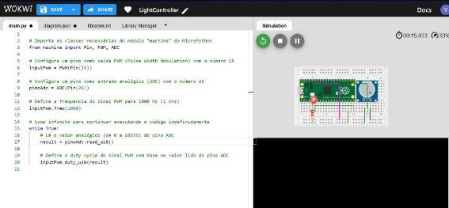

## INSTITUTO DE TECNOLOGIA E LIDERANÇA CURSO DE CIÊNCIA DA COMPUTAÇÃO

## ESTUDO DE PLATAFORMA EMBARCADA: CONTROLE DE LUMINOSIDADE DO AMBIENTE PARA DIMINUIR A SENSIBILIDADE DE CRIANÇAS AUTISTAS(TEA) COM USO DE RASPBERRY PI PICO

#### Por: YASMIN VITÓRIA ROCHA DE JESUS

O presente trabalho tem por objetivo identificar características, uso, compatibilidade de componentes e suas comunicações, além de envolver a simulação como demonstração do sistema e seu propósito que circundam o Raspberry Pi Pico, disponível na plataforma de simulação Wokwi. Desse modo, utilizamos tais catalogações para entender como funcionará o processo de criação de um projeto base, que neste caso, será a possibilidade de controlar a luminosidade de lâmpadas com potenciômetro a fim de tornar ambientes propícios para crianças autistas sensíveis a luz e que, consequentemente expressam estresse devido ao alto nível de luminosidade em diversos locais.

### **MANUAL DE REFERÊNCIA DO COMPONENTE**
 **Descrição do dispositivo**

O Raspberry Pi Pico é uma placa com microcontrolador desenvolvido pela Raspberry PI Foundation. Ele possui um custo benefício que garante acessibilidade, além de um alto desempenho com interfaces digitais. O Raspberry Pi Pico tem algumas limitações, por isso possui alguns dos pinos de interface sem fio são compartilhados. As linguagens mais populares para fazer uso do Raspberry Pi Pico é o MicroPython e C/C++, sendo comumente usado na criação de sistemas embarcados.

**Especificações Técnicas**

O Raspberry Pi Pico é equipado com um chip que se encontra em seu centro, sendo identificado com RP2040. Destaca-se seus dois núcleos ARM Cortex-M0+ com 32 bits e clock rodando a 133MHZ. Sua memória RAM é de 256KB, memória flash de 2MB de armazenamento, contando com periféricos de GPIO com 26 pinos que conecta com LEDs, sensores e outros dispositivos. Além disso, possui suporte para comunicação serial e protocolos, tendo porta via I2C, SPI e UART, três entradas analógicas para garantir a leitura de sensores de luz e potenciômetro e 16 pinos PWM para controle de LEDs RGB, tendo fonte de alimentação via micro USB e de pinos externos como 3,3V e GND.

Fonte: Datasheet

**Instruções de uso**

O Raspberry Pi Pico pode ser usado virtualmente através de um simulador e fisicamente, referente a modalidade física, a maior parte dos exemplos disponíveis na internet utiliza-se uma protoboard. É importante salientar que o Raspberry Pi Pico não possui botão de Reset, mas pode-se usar a placa no modo UF2 para conectar e desconectar o cabo USB ou optar pela maneira mais adequada, que é utilizar o pino RUN e cada vez que é colocado no valor zero, ocorre a reiniciação. Aqui podemos adicionar também um push button para facilitar as ações. Para programar a placa Raspberry Pi Pico pode-se utilizar a linguagem MicroPython citada anteriormente, atualizando o firmware da placa para a versão binária. Uma vez feita a atualização e colocado a placa no modo UF2, com uso de reset button com o push button, é só ligar a placa ao USB do computador e pressionar o botão boot para posteriormente configurar o monitor serial. É possível conectar com o Arduino IDE e com o Thonny, há documentações específicas para isso. No entanto, neste trabalho, será usado o simulador Wokwi que possui as mesmas especificações que a placa física real do Raspberry Pi Pico, sem necessitar de configurações e conexão USB no computador, visto que é um ambiente virtual, ou seja, os únicos requisitos é saber suas características que já foram descritas anteriormente e suas funcionalidades.

Para o uso do Wokwi, é necessário criar uma conta, ao acessar a Home, é possível verificar a opção Pi Pico e ter projetos como exemplo ou modelos iniciais. Nesse caso, será utilizado o template de modelo inicial Raspberry Pi Pico, não é necessário instalar nada, será necessário apenas os componentes que será abordado a seguir e a importação de um módulo chamado Machine, utilizando a linguagem MicroPython.

**Funcionalidades(informações complementares)**

Há maneiras de aumentar a capacidade do Raspberry Pi Pico, como emissão de vídeo, configurar internet, áudio etc. Ao comparar com outros microcontroladores, o Raspberry Pi Pico tem menos poder computacional. Para ter Wi-fi por exemplo, é necessário instalar, assim como é necessário instalar Bluetooth e adicionar ethernet. Ademais, também é possível integrar a placa com um módulo de câmera

Em relação ao sistema operacional, no Raspberry Pi Pico não há um sistema operacional rodando, na maioria das vezes é preciso carregar o código e depois executar o programa, ou seja, não é necessário um sistema operacional, porém, programar o Raspberry pode limitar a execução de tarefas e, por mais que a programação seja possível, isso não descarta a possibilidade de utilizar sistemas operacionais que funcionam no Raspberry Pi Pico.

A placa também possui pinos específicos para depuração, esses pinos depuradores permitem pausar a execução e verifica os valores de variáveis, passando linha por linha, tornando a depuração mais fácil. Assim como qualquer outro microcontrolador, é possível conectá-lo com sensores, seja um potenciômetro, sensor de temperatura, entre outros. Neste trabalho, será utilizado o Potenciômetro conectado ao Raspberry Pi Pico, além do uso do LED e resistor para manter o controle do sistema e observar os resultados obtidos com as interações.

### **INTERFACE DE COMUNICAÇÃO COM O COMPONENTE**
1. **Descrição da Interface**

O projeto a ser criado, é uma interface simples que baseia-se no controle de luminosidade de um LED. Para isso, o potenciômetro age como um divisor de tensão variável e pode fornecer uma resistência variável em um circuito elétrico. No contexto de controlar a luminosidade, ele funciona ajustando a quantidade de corrente elétrica que passa através do circuito, o que, por sua vez, controla o brilho de uma luz. O usuário pode ajustar a luz para qualquer valor dentro do alcance do componente.

**Compatibilidade**

O Raspberry Pi Pico é compatível com o potenciômetro utilizado na plataforma Wokwi, isso porque a tensão e a corrente são compatíveis. A leitura do potenciômetro é realizada através do pino ADC (Analog to Digital Converter) do Raspberry Pi Pico e o protocolo de comunicação (conversão analógico-digital) é compatível, permitindo a interpretação correta do sinal analógico do potenciômetro. A escolha da linguagem Micro Python, se deve também pelo fato de ser compatível com o módulo Machine que facilita a implementação do código, garantindo a compatibilidade de software entre o Raspberry Pi Pico e o potenciômetro.

**Pinos e conexões**

O potenciômetro geralmente tem três pinos: um pino central (wiper) e dois pinos externos.

O pino central está conectado ao ponto variável do potenciômetro. É preciso Conectar o pino central do potenciômetro com um pino de entrada analógica (ADC) no Raspberry Pi Pico, como o pino 26. Também é necessário conectar um dos pinos externos ao GND (terra) do Raspberry Pi Pico e o outro ao VCC(tensão de alimentação), geralmente 3,3V.

Para a leitura do valor do potenciômetro, no código em Micro Python, usa-se a classe machine.ADC para ler o valor do potenciômetro. O valor lido será um número entre 0 e 65535, representando a posição atual do potenciômetro. Esse valor lido ajusta a luminosidade do LED que é controlado pelo Raspberry Pi Pico.

## COMO UTILIZAR UMA DAS INTERFACES DE COMUNICAÇÃO
**Descrição do projeto**

O projeto consiste em um Raspberry Pi Pico e potenciômetro que controla a potência luminosa de um LED, o qual foi utilizado a linguagem MicroPython. Este projeto é uma base com o objetivo de diminuir o estresse de pessoas autistas que possuem sensibilidade à iluminação, para que futuramente seja um sistema IoT em que o usuário possa controlar a luminosidade do ambiente diretamente de seu dispositivo móvel por meio de uma interface. “O humor das crianças é fortemente afetado pela iluminação: para algumas proporciona um efeito calmante e para outras atua como estimulante. A iluminação forte muitas vezes pode machucar os olhos de uma pessoa com autismo(….) muitas vezes é aconselhável usar iluminação ajustável para criar um efeito calmante.” — Autism Parenting Magazine

**Esquema de conexão**

Para criar nosso sistema, utiliza-se uma board para conectar todos os componentes, sendo eles o LED, o Raspberry Pi Pico, o potenciômetro e o resistor com seus devidos fios.

|**Tipo de componente**|**Conexão**|**Componente conectado**|
| - | - | :- |
|

**LED**
|
- Pino GP15(+)

- Resistor(-)
|Resistor 220Ω|
|

**Raspberry Pi Pico**
|
- GND4(-)

- 3V3(+)

- GP26(SIG potenciômetro)
|Potenciômetro|
|

**Potenciômetro**
|
- VCC(+)

- GND(-)

- SIG(GP26 Raspberry Pi Pico)
|Raspberry Pi Pico|
|

**Resistor 220Ω**
|LED(-)|LED|

**Código fonte**

O código fonte utiliza-se o módulo machine PWM para criar sinais e controlar a intensidade do LED, o uso do ADC para converter o sinal analógico em digital e o PIN referente ao terminal de entrada e saída.

**Resultados**

Os resultados foram positivos e atenderam as expectativas, o potenciômetro controla bem a luminosidade do LED, tendo diferentes tipos de potência, desde a mais alta até a mais baixa, isso depende do giro do potenciômetro.

|Status 1 - LED com luminosidade forte||
| :- | - |

|Status 2 - Luminosidade baixa após ser controlado||
| :- | - |
|Status 3 - LED apagado||

Sendo assim, o projeto completo é este:

O projeto demonstrou-se bem sucedido ao utilizar o Raspberry Pi Pico, potenciômetro e um LED, juntamente com a linguagem MicroPython, oferecendo controle adaptável de luminosidade. Sendo assim, permite que os usuários ajustem a intensidade da luz, fornecendo um ambiente propício para pessoas autistas com sensibilidade à luz. O projeto cria ambientes mais acolhedores e menos estressantes. A simplicidade da implementação torna o projeto acessível, destacando os detalhes do Raspberry Pi Pico e de outros componentes utilizados. Além de cumprir seu propósito técnico, o projeto tem um impacto social positivo, melhorando a qualidade de vida e exemplificando como a tecnologia pode ser inclusiva.
